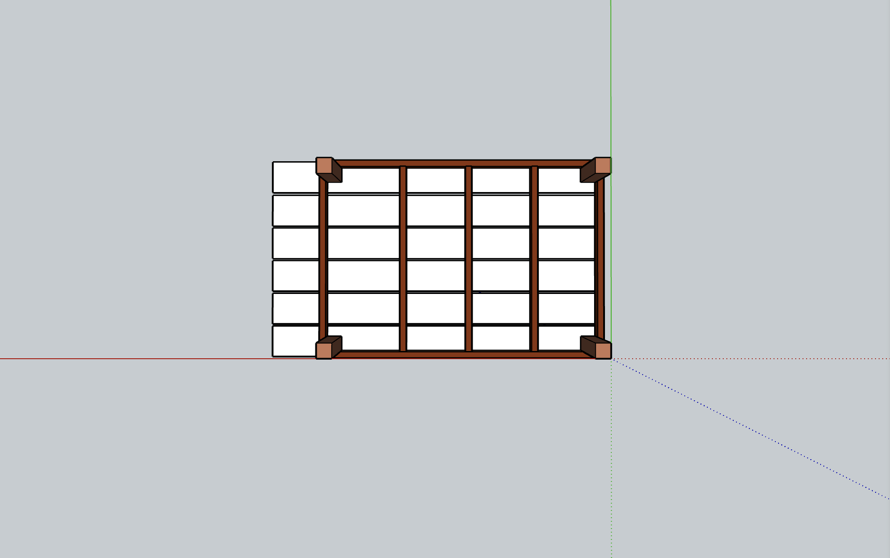
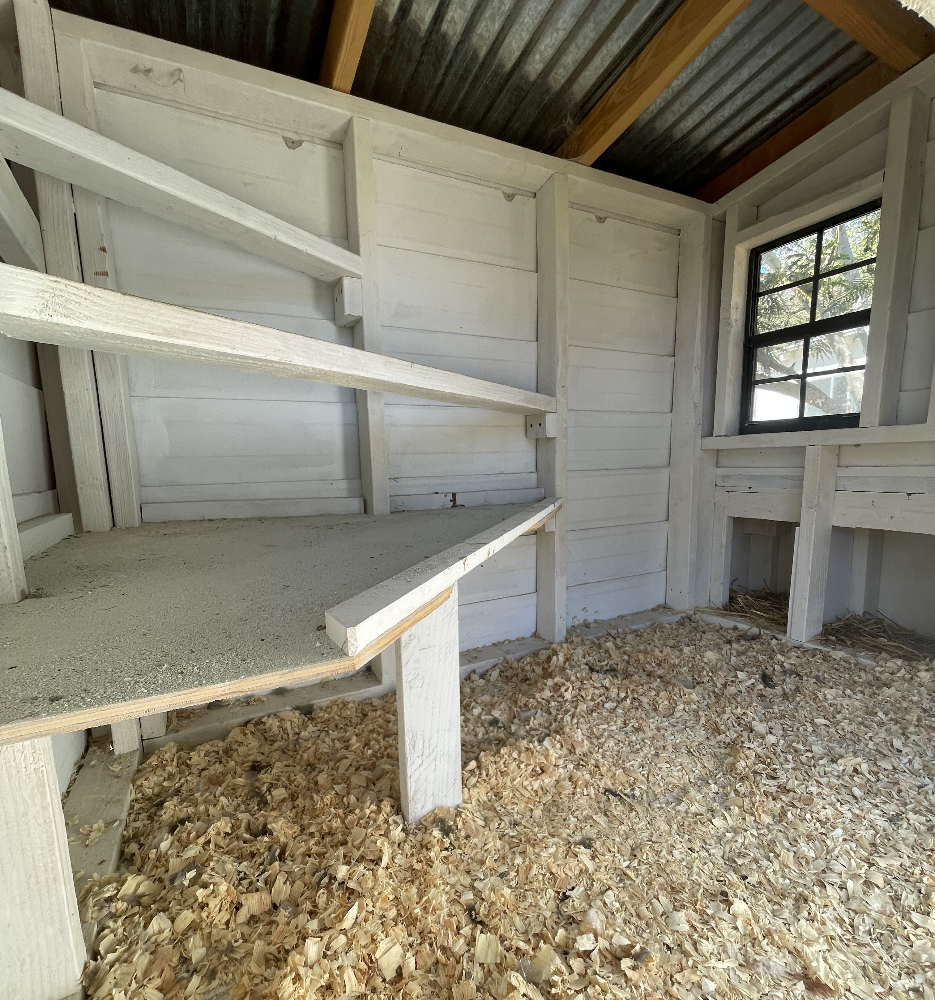

In early 2023 I began work on a backyard chicken coop. I wanted something that was aesthetically designed and situated in the yard, provided a comfortable home for up to 6 birds, and, importantly, was easy to maintain and service. This project also provided a great opportunity to practice my CAD skills, carpentry, and resource planning.

Here's the money shot:

And another angle with the birds:

*Happy birds produce good egss and happy humans.*

It's a raised coop, roughly 6 foot by 4 foot, with a sloped roof, 3 windows on 2 walls, a couple swinging doors for human entry and a chicken door with ramp for bird entry. Extending out from the north wall are 3 nesting boxes, which have a down-swinging door for easy egg retrieval. This design takes inspiration from two other small structures I was able to find plans online for; one a chicken coop[[1]](#notes) and one a playhouse[[2]](#notes).

Six months into moving our birds into the coop, I'm quite happy with how it turned out and think it's an ideal design with only minor notes for improvement.

<figure>
  

    <video autoplay playsinline controls loop muted preload="auto">
      <source src="/front_to_back_orbit.mp4" type="video/mp4">
    </video>
  

</figure>

## Design

I want to highlight some of the design decisions which make this design work well.

### Raised platform

Having the coop raised off the ground provides a couple advantages.
  1. **Easy to clean**–The coop floor can be thoroughly cleaned. We can use any material for the bedding: wood shavings, straw, sand etc. and change this up easily if we want to try something new. When the coop is set on the ground, you're always going to be dealing with some level of dirt and mud when it rains. This seems harder to keep clean than wooden floor boards which can be scrubbed down if necessary. The floor of the coop is designed to be just a bit higher than the height of a wheel barrow. This means I can pull my wheel barrow right up to the coop doors and scoop all the dirty bedding right into the wheel barrow, then easily transport to compost or yard waste bins.
  1. **Shelter**–The space under the coop provides a place for the birds to hideout and seek shelter from rain or the heat on hot days, as well as predators in the sky, namely red-tailed hawks. We put the chicken feeder under the coop, which helps to keep their food nice and dry when it rains.

### Windows

Not only do they look nice, but they are also functional. I put them on 2 walls–one window on the north wall and two smaller ones on the east-facing wall. Beyond letting light in, we can open the windows during the summer to provide a draft through the coop when it's hot. I didn't want the windows on the south or west-facing walls, as these are the sunniest sides and therefore the hottest sides. We've kept them closed during the colder months.

These were all purchased through Amazon, for about $35 each and I'm pretty happy with them. They are sliding "shed" windows. The glass is tempered, and they come with wire mesh screens to keep bugs out.

### Three nesting boxes

You can probably get by with 2 nesting boxes for 6 chickens, so the third is maybe unnecessary. We've ended up using the third box for storing some items. However, with about 4 feet of length along the side of the coop, 3 boxes fit nicely. Each box interior is roughly a one foot cube.

To create the floor for the nesting boxes, the 2x8 floor boards were extended out past the floor joists on the north wall.

*Floor boards run past the floor frame on the north side.*

The down-swinging door is latched on both sides of the coop, so it cannot be accidentally opened.

<figure>
  

    <video autoplay playsinline controls loop muted preload="auto">
      <source src="/nesting_box_door_480.mp4" type="video/mp4">
    </video>
  

</figure>

### A dropping board

The dropping board is situated underneath the roosting bars and its purpose is to catch all the droppings from the birds while they're sleeping on the bars each night. I set it about 17 inches above the floor of the coop, so that a 5 gallon bucket can be stored snugly underneath it. It should have rails all around the perimeter, except for the front, so that droppings can be easily swept off the board into the bucket below. The rails act as guides as you sweep the droppings towards the front of the board. You should try to get the board flush to the coop walls to eliminate any small gaps where droppings can get stuck or be hard to sweep up. By doing quick cleans of the dropping board everyday, we're able to keep the coop cleaner for longer between more extensive deep cleans.

*The dropping board platform catches droppings from the birds while they sleep on the roosting bars above.*

<figure>
  

    <video autoplay playsinline controls loop muted preload="auto">
      <source src="/dropping_board_in_action_480.mp4" type="video/mp4">
    </video>
  

</figure>

### Ladies First Chicken Door

This is a product I bought online[[3]](#notes). When I saw this door, I knew I had to splurge on it. Afterall, I'm going for ease-of-maintenance with this coop. The Ladies First Chicken Door is a fully solar-powered chicken door that uses a light sensor to open shortly after dawn and close after dusk, letting the birds in and out of the coop every day, while keeping them safe. It's worked amazingly. In the photo at top, you can see the small solar panel mounted at the top of the coop. As small a task as opening and closing a chicken door is, automating this daily task seemed well-worth the money.

---

### Resources

1. [The Third Coast Craftsman Chicken Coop](https://www.thirdcoastcraftsman.com/product-page/chicken-coop-and-run-plans)
1. [Bert's Play Fort Plans](https://www.elevatedspaces.ca/products/modern-playhouse-plans)
1. [Ladies First Chicken Door](https://www.ladiesfirstchickendoor.com/)